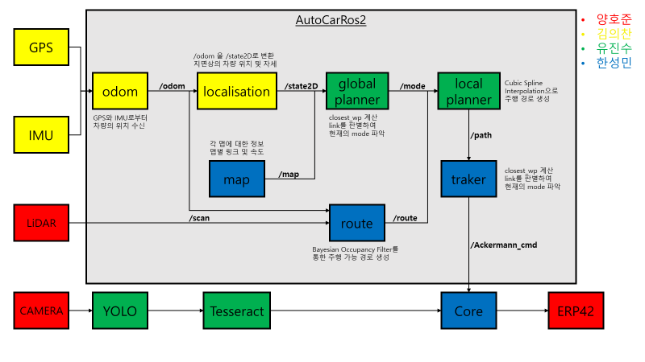

# 2023CAPSTONE
Ros2 환경에서 자율주행 자동차 개발



```bash
pushd imu/lib/xspublic && make && popd

cd AutoCarROS2
sh ros-foxy-desktop-full-install.sh
sh requirements.sh

cd ~/robot_ws/src/yolov7
pip install -r requirements.txt

```

```bash
source /opt/ros/foxy/setup.bash
source ~/robot_ws/install/local_setup.bash

alias gd='sudo gedit ~/.bashrc'
alias sc='source ~/.bashrc'
alias noetic='echo \"Noetic is Activated!\"; source /opt/ros/noetic/setup.bash; source ~/catkin_ws/devel/setup.bash'
alias foxy='source /opt/ros/foxy/setup.bash; source ~/robot_ws/install/local_setup.bash; echo \"Foxy is Activated!\"'

alias cm='catkin_make'
alias dev='source ~/catkin_ws/devel/setup.bash'
alias cw='cd ~/robot_ws'
alias cs='cd ~/robot_ws/src'
alias ins='source ~/robot_ws/install/local_setup.bash'

alias rd='rosdep install --from-paths . --ignore-src -r -y'
alias cb='colcon build --symlink-install'
alias cbp='colcon build --symlink-install --packages-select'

alias rt='ros2 topic list'
alias re='ros2 topic echo'
alias rn='ros2 node list'

alias bag_odom='ros2 bag play ~/bag_file/0615_stanley/12km_parking_1.db3 --topics /ublox_gps/fix /ublox_gps/fix_velocity /filter/quaternion -l'
alias scan_bag='ros2 bag play ~/bag_file/lidar/lidar.db3 -l --topics /velodyne_points /scan'
alias tr_bag='ros2 bag play ~/bag_file/yolo_test/traffic_light.db3 -l'
alias de_bag='ros2 bag play ~/bag_file/yolo_test/delivery.db3 -l'

alias viz='ros2 launch launches bag_launch.py'
alias simul='ros2 launch launches simul_launch.py'
alias odom='ros2 launch launches odom_launch.py'
alias path='ros2 launch launches path_launch.py'

alias front='cd ~/robot_ws/src/lanenet && python3 camera_pub.py --ns /front --source'
alias side='cd ~/robot_ws/src/lanenet && python3 camera_pub.py --ns /side --source'
alias lane='cd ~/robot_ws/src/lanenet && python3 camera_pub.py --ns /lane --source'
alias rqt_image_view='ros2 run rqt_image_view rqt_image_view'

alias traffic='cd ~/robot_ws/src/yolov7 && python3 trafficlight.py'
alias delivery='cd ~/robot_ws/src/yolov7 && python3 delivery.py'
alias lanenet='cd ~/robot_ws/src/lanenet && python3 lanenet.py'

alias ip='sudo ifconfig enp2s0 192.168.3.121'
alias velodyne='ros2 launch velodyne velodyne-all-nodes-VLP16-launch.py'
alias cluster='ros2 launch launches cluster_launch.py'

alias enc_tic='ros2 run autocar_odom get_encoder.py'
alias enc_vel='ros2 run autocar_odom encoder_vel.py'

alias port='sudo chmod 777 /dev/tty*'
alias gps='noetic && roslaunch ublox_gps ublox_device.launch'
alias ntrip='noetic && roslaunch ntrip_ros ntrip_ros.launch'
alias param='noetic && roslaunch load_params load_params.launch'
alias bridge='foxy && ros2 run ros1_bridge parameter_bridge'
alias imu='ros2 run bluespace_ai_xsens_mti_driver xsens_mti_node'
alias erp='ros2 run erp_control ERP42_ros2'
alias yaw='ros2 param set odom_pub yaw_init'
alias cy='ros2 param set odom_pub yaw_offset_array []'
alias mp='ros2 run autocar_odom move_position.py'
alias yi='ros2 run autocar_odom get_yaw_init.py'

export PATH=$PATH:/usr/local/cuda-11.4/bin
export LD_LIBRARY_PATH=$LD_LIBRARY_PATH:/usr/local/cuda-11.4/lib64
export CUDADIR=/usr/local/cuda-11.4
```
