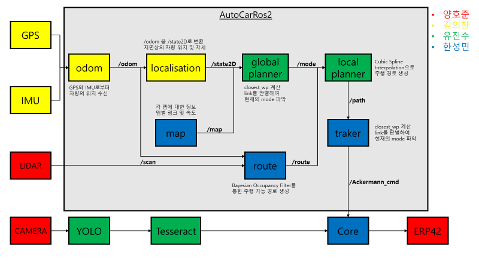

# 2023CAPSTONE_AutoCar_in_Ros2
Ros2 환경에서 자율주행 자동차 개발



```bash
pushd imu/lib/xspublic && make && popd

cd AutoCarROS2
sh ros-foxy-desktop-full-install.sh
sh requirements.sh

```

```bash
source /opt/ros/foxy/setup.bash
source ~/robot_ws/install/local_setup.bash

alias gd='sudo gedit ~/.bashrc'
alias sc='source ~/.bashrc'
alias noetic='echo \"Noetic is Activated!\"; source /opt/ros/noetic/setup.bash; source ~/catkin_ws/devel/setup.bash'
alias foxy='source /opt/ros/foxy/setup.bash; source ~/robot_ws/install/local_setup.bash; echo \"Foxy is Activated!\"'

alias cm='catkin_make'
alias dev='source ~/catkin_ws/devel/setup.bash'
alias cw='cd ~/robot_ws'
alias cs='cd ~/robot_ws/src'
alias ins='source ~/robot_ws/install/local_setup.bash'

alias rd='rosdep install --from-paths . --ignore-src -r -y'
alias cb='colcon build --symlink-install'
alias cbp='colcon build --symlink-install --packages-select'

alias rt='ros2 topic list'
alias re='ros2 topic echo'
alias rn='ros2 node list'

alias bag_odom='ros2 bag play bag_file/5_straight/5_straight.db3 --topics /filters/quartenion /ublox_gps/fix -l -r 2'
alias odom='ros2 launch launches odom_launch.py'
alias path='ros2 launch launches path_launch.py'

alias rqt_image_view='ros2 run rqt_image_view rqt_image_view'

alias gps='roslaunch ublox_gps ublox_device.launch'
alias vrs='roslaunch ntrip_ros ntrip_ros.launch'
alias gnss='roslaunch ntrip_ros ntrip_ros_gnss.launch'
alias ssr='roslaunch ntrip_ros ntrip_ros_ssr.launch'
alias param='roslaunch load_params load_params.launch'
alias bridge='ros2 run ros1_bridge parameter_bridge'
alias imu='ros2 run bluespace_ai_xsens_mti_driver xsens_mti_node'
```
